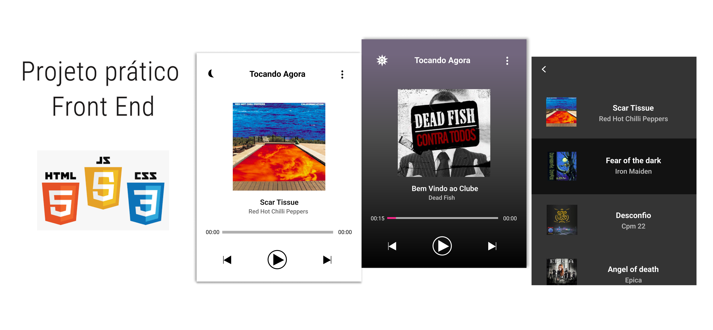

# Player de música com HTML, CSS e Javascript
 
 

## Projeto

Através do HTML5 Audio API, desenvolvi uma aplicação de player de música com recursos como lista das músicas, tema escuro/claro com uso de localStorage e aviso ao usuário de qual música está sendo tocada no momento. 


## Tecnologias

Uso de Javascript Puro(Vanilla JS), de Flexbox para obter responsividade, técnica de acessibilidade utilizando aria-label, aria-controls, aria-expanded nos botões, além de utilizarmos o evento de DOMContentLoaded e localStorage para guardar a escolha do usuário por tema escuro/claro do usuário.


## Prototipagem com Figma

Nesse [link](https://www.figma.com/file/86FIiUJdrxZm5DdHI2Wl3J/Player-Musica?node-id=0%3A1 "Layout no Figma") você visualiza o projeto de Layout no Figma. 


## Quais habilidades você adquiri com esse projeto?

Técnicas de acessibilidade como aria-expanded ao abrir a playlist
Nem todo evento tem bublble event
Eventos e suas diferenças: click, timeupdate, DOMLoadedContent x Load
Passar um objeto para JSON ou como ler esse objeto depois de adicionado itens: JSON.stringfy() e JSON.parse()
Qual tipo de armazenamento é interessante para seu projeto: localStorage x sessionStorage

Alguns pontos importantes do player:


```javascript

// marca música na playlist que está sendo tocada
function playlistMarkup(){

    const $asideTitle = document.querySelectorAll('.aside__title');
    // pego so titulos das musicas que stão na plylist
    // array com 10 h2  [ h2.aside__title, h2.aside__title, ... ]

    for(let i = 0; i < $asideTitle.length; i++){

        // comparo o texto de cada h2 com o titulo da música do array principal 'music'
        if($asideTitle[i].textContent === $albumTitle.textContent){

            // é igual? então add a class playSong(clas com cor de texto rosa)
            $asideTitle[i].classList.add('playSong');
        }
        else{
            // se não for igual, remove class PlaySong
            $asideTitle[i].classList.remove('playSong');
        }
    }
}


// barra de progresso está tocando e 
// vai atualizando conforme o tamanho do width da música
function animationProgress(e){

    // pega o tempo atual da música
    const currentTime = e.target.currentTime;
    // pega a duração total da musica
    const duration = e.target.duration;
    // faz o calculo para achar o percentual de width no momento atual
    const percentWidth = (currentTime / duration) * 100;
    
    // muda o atributo de width da barra de progresso conforme a música vai tocando
    // assim vai ficando uma barra de progresso animada
    $containerProgress.setAttribute('style',`width:${percentWidth}%`);
}


// escolher tema dark ou light e guardar no localStorage
function darkLightMode(){

    // a classe é do modo DarkMode(Tema escuro) ou nao
    $container.classList.toggle('darkMode');
    
    // a classe é do modo DarkMode(Tema escuro)
    if($container.classList.contains('darkMode')){
        // mudo o valor do localStorage e coloco 'true' para sinalizar modo escuro;
        // JSON recebe um objeto {dark:'true'} e
        // transforma em uma string
        localStorage.setItem('theme',JSON.stringify({dark: 'true'}));        
    }
    else{
        localStorage.setItem('theme',JSON.stringify({dark: 'false'}));
    }
}

// Eventos

audio.addEventListener('timeupdate',(e) => {
    // enquanto o audio está tocando...
    //calculo o width da barra de progresso(cor rosa)
    animationProgress(e);
    // calculo tempo inicial e final da música
    screenMin(e);
    // qual música está tocando e mostro ao usuário
    playlistMarkup();
});


// abrir a playlist e salvar a mudança de tema escuro/claro
$albumInfo.addEventListener('click', (e) => {
    e.preventDefault();
    if(e.target.className === 'btn__theme' || e.target.className === 'icon__mode'){
        darkLightMode();
        setTheme();
    }
});


```


### Live do projeto
player rodando projeto Github


